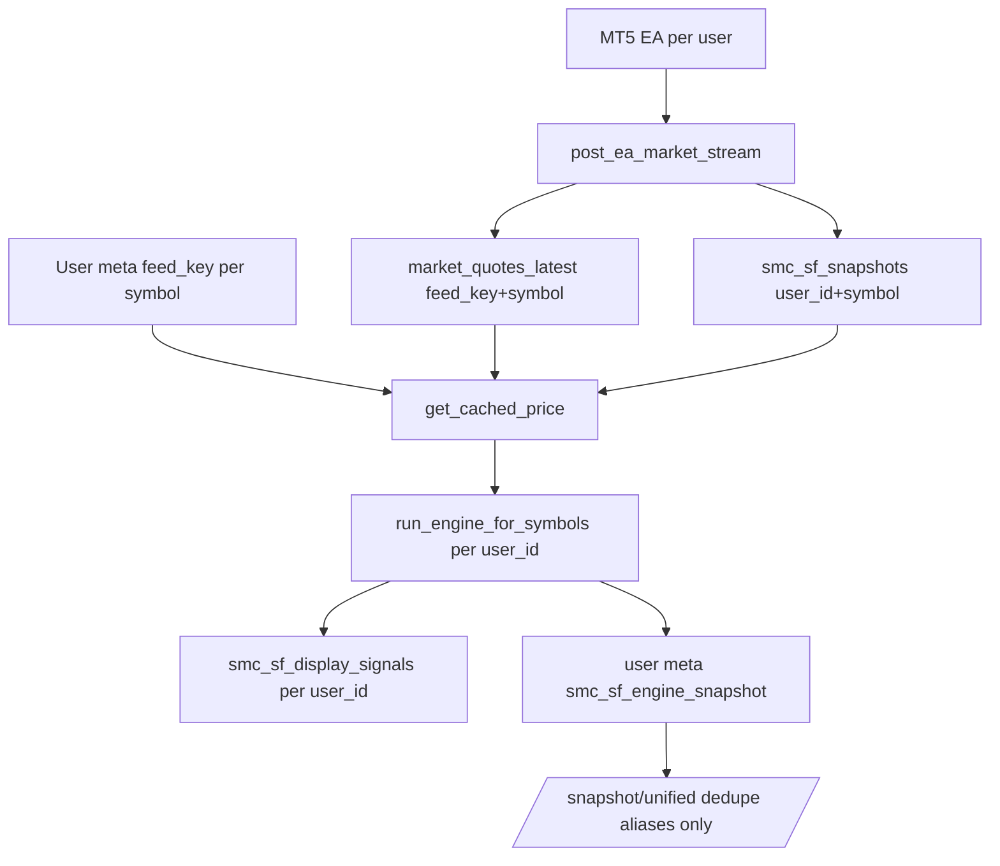

# Canonical Feed / Signal Divergence Stabilization Plan

## Investigation Findings (Confirmed)

### Missing canonical layer — **YES, partially**

The backend has **symbol-alias dedupe** ([`class-signal-aggregator.php`](wordpress/smc-superfib-sniper/class-signal-aggregator.php)) and **feed_key-scoped shared tables** (`smc_sf_market_quotes_latest`, `smc_sf_market_candles`), but **no unified canonical market-state resolver**. Market truth is still assembled **per user**:



**First backend divergence points** (in order of impact):

| Layer | Issue | File |
|-------|-------|------|
| Price | Shared quote hardcodes `state: 'live'` regardless of age | [`fetch_shared_market_quote()`](wordpress/smc-superfib-sniper/smc-superfib-sniper.php) ~9302–9315 |
| Authority | `is_mt5_authoritative()` uses `PHP_INT_MAX` — dead MT5 never loses authority | ~9707–9715 |
| Feed key | `resolve_user_shared_feed_key()` reads **only user meta** — stale feed_key never rotates to a fresh canonical feed | ~5410–5415 |
| Candles | `fetch_candles()` uses user-locked feed_key → different candle histories → different regimes/signals | ~7736–7738 |
| Engine | Full pipeline is per-user: settings, snapshot cache, display board | `ensure_engine_snapshot()` ~9110, `reconcile_live_signal_board()` ~6204 |
| Dedupe | `/snapshot/unified` dedupes broker suffixes **within one user's price array only** | ~2147–2151 |

### Still/stale price feed — root cause

1. **`fetch_shared_market_quote()` returns `state: 'live'`** even when age is within `max_age_sec` but past `staleThresholdSec` (age check returns null only when *above* max, but surviving rows are always labeled live).
2. **`is_mt5_authoritative()` never expires** — `refresh_prices()` keeps calling MT5 path with stale shared/per-user rows.
3. **User locked to stale `feed_key`** in user meta with no DB fallback to the freshest `market_quotes_latest` row for the same normalized symbol.
4. **Frontend soft-masking**: React Query `keepPreviousData` + tick interpolation can show a moving/still price between polls even when backend state is stale (Live page respects backend `price.state`; Plan page uses client-clock `staleThresholdSec` — cross-page asymmetry).

### Two-user signal divergence — root cause

Given the same production backend URL and same watchlist, divergence comes from **different canonical inputs**, not frontend signal synthesis:

- Different per-user `feed_key` → different shared quotes/candles
- Different per-user MT5 snapshot rows (`user_id` PK on `smc_sf_snapshots`)
- Per-user engine snapshot cache timing (`refreshIntervalSec`, `staleThresholdSec`)
- Per-user display signal board history (`user_id` in `compute_signal_family_key()`)

Frontend is **not creating signal truth** — it polls `/snapshot/unified` and `/live-signals` with `cacheBust: true` and preserves backend fields only ([`sniperClient.ts`](src/lib/api/sniperClient.ts)).

**Pre-patch diagnostic** (manual, before/after): authenticated curl comparison for User A vs User B on `/wp-json/sniper/v1/snapshot/unified` and `/live-signals` — compare normalized symbol, bid/ask/mid, regime, gate, signal id/direction/entry/SL/TP, `updatedAt`, `age_sec`, `state`.

---

## Patch Strategy (Smallest Safe Diff)

### Phase 1 — Backend canonical resolver (primary fix)

Add new file [`wordpress/smc-superfib-sniper/class-canonical-market-resolver.php`](wordpress/smc-superfib-sniper/class-canonical-market-resolver.php) — pure resolver, no REST logic:

**`resolve_canonical_feed_key(string $normalized_symbol, string $user_feed_key, int $stale_threshold_sec): array`**
- If `$user_feed_key` has a fresh row in `market_quotes_latest` → use it (log: `rotation_reason= user_feed_fresh`).
- Else query `market_quotes_latest` for `$normalized_symbol` across all feed_keys, pick row with newest `updated_at` within `$stale_threshold_sec`.
- If none fresh → return stale/offline metadata with the least-stale row for explicit state (never fake live).
- Internal-only log fields: `feed_key`, `feed_key_age`, `rotation_reason`, `canonical_resolver_path`.

**`resolve_canonical_quote(string $normalized_symbol, int $stale_threshold_sec): ?array`**
- Uses resolver feed_key selection above.
- Returns quote with **computed `state`** (`live` / `stale` / `offline`) from `iso_age_sec()` vs threshold — mirrors per-user snapshot logic.
- Strips provenance from public payload (keep `sourceDetail`/`feed_key`/`source_count` as internal-only keys already marked in frontend types).

**Wire into existing paths** (minimal touch points in [`smc-superfib-sniper.php`](wordpress/smc-superfib-sniper/smc-superfib-sniper.php)):

1. **`fetch_shared_market_quote()`** — delegate feed_key selection to resolver; **remove hardcoded `'state' => 'live'`**; apply stale threshold to state field.
2. **`fetch_shared_market_candles()` / `fetch_candles()`** — use resolver-selected feed_key instead of only `resolve_user_shared_feed_key()`.
3. **`get_cached_price()`** — after shared quote attempt, if per-user MT5 row exists, still prefer **canonical resolver quote** when fresher (same symbol, global truth).
4. **`is_mt5_authoritative()`** — replace `PHP_INT_MAX` with caller's `staleThresholdSec`; authority = fresh MT5/shared quote OR recent ingest transient, not historical row existence.
5. **`refresh_prices()`** — pass canonical quote into engine input array.

**Preserved intentionally:**
- Per-user display signal board (lifecycle, entry hits, board size) — user-scoped execution state is OK.
- Pine/fib/entry/SL/TP/chop formulas untouched.
- Existing REST routes and response shapes — additive `meta.canonicalResolvedAt` optional, no breaking removals.

### Phase 2 — Stale MT5 authority hardening

In [`smc-superfib-sniper.php`](wordpress/smc-superfib-sniper/smc-superfib-sniper.php):

- **`fetch_shared_market_quote()`**: if age > threshold → return `null` (existing) AND ensure any surviving quote has correct non-live state.
- **`is_mt5_authoritative()`**: require `state === 'live'` AND `age_sec <= staleThresholdSec`.
- **`post_ea_market_stream()`**: when updating shared quote, if EA sends `freshness: STALE/CLOSED/DISCONNECTED`, persist into shared row metadata and surface in resolver state decision.
- Add internal `error_log` diagnostics (not REST fields): `user_id`, `normalized_symbol`, `mt5_authority_decision`, `fallback_decision`, `stale_reason`.

### Phase 3 — REST cache headers

Extend [`no_cache_response()`](wordpress/smc-superfib-sniper/smc-superfib-sniper.php) (~10585):

```php
$response->header('Cache-Control', 'no-store, no-cache, must-revalidate, max-age=0');
$response->header('Expires', '0');
```

Apply to endpoints currently missing it:
- `get_regimes()` (~5665)
- `get_market_data_authority()` (~2525)
- `get_user_settings()` / session endpoints that return dynamic auth-sensitive data

Verify with `curl -I` on: `/snapshot/unified`, `/live-signals`, `/ladders`, `/charts`, `/regimes`.

### Phase 4 — Frontend hardening (secondary, cannot fix divergence alone)

[`src/lib/version.ts`](src/lib/version.ts) + [`vite.config.ts`](vite.config.ts):
- Inject `__BUILD_ID__` (git short SHA or CI timestamp) at build time.
- Add `SCHEMA_VERSION` constant; on app boot ([`src/router.tsx`](src/router.tsx) or auth init), if stored schema ≠ current, invalidate React Query cache keys `snapshot`, `live-signals`, `ladders` and log console-safe mismatch (do **not** wipe user preferences like watchlist/backendUrl unless schema mismatch on unsafe keys).

[`src/hooks/useSniperData.ts`](src/hooks/useSniperData.ts):
- When snapshot poll returns any price with `state !== 'live'`, **do not** use `keepPreviousData` for that symbol's price display path (or clear placeholder on stale transition).
- Add dev-only `console.debug('[SMC] backendUrl=', getBackendUrl())` on settings load for parity diagnostics.

[`src/routes/-plan.page.tsx`](src/routes/-plan.page.tsx):
- Align `getFreshnessState()` with Live page — trust backend `price.state` first; use client-clock `staleThresholdSec` only as secondary guard (removes Plan/Live asymmetry for same snapshot).

[`src/lib/api/sniperClient.ts`](src/lib/api/sniperClient.ts):
- Ensure 401/403 paths never fall back to cached snapshot data (already throws `AuthError` — add test assertion).

No Cloudflare cache rules (out of scope per deployment context).

### Phase 5 — Regression tests

New PHP test file: [`wordpress/smc-superfib-sniper/tests/php/test-canonical-market-resolver.php`](wordpress/smc-superfib-sniper/tests/php/test-canonical-market-resolver.php)

| # | Test |
|---|------|
| 1 | Two user contexts, same normalized symbol + fresh shared quote → identical bid/ask/mid/state |
| 2 | User-scoped stale feed_key → resolver rotates to fresher feed_key for same symbol |
| 3 | Stale shared quote (> threshold) → not `live`; MT5 authority false |
| 4 | Stale MT5 authority → explicit stale/offline, no Twelve Data masquerade as live |
| 5 | Resolver does not switch to unrelated symbol feed |
| 6 | `/snapshot/unified` emits no-store/no-cache/Expires headers |
| 7 | Unauthorized request → no fake live fallback payload |
| 8 | Candle shortfall from disputed feed_key excluded; canonical feed_key candles used for both users |

Extend [`test-ea-market-stream.php`](wordpress/smc-superfib-sniper/tests/php/test-ea-market-stream.php): shared quote state reflects age (not always live).

Frontend tests ([`src/hooks/useSniperData.test.tsx`](src/hooks/useSniperData.test.tsx), [`src/lib/api/sniperClient.test.ts`](src/lib/api/sniperClient.test.ts)):
- Schema version mismatch clears unsafe query cache
- Stale snapshot poll does not retain previous live price via placeholder
- `grep`-style assertion: no render of `feed_key`/`source_count`/`sourceDetail` in routes (existing test coverage extended)

Run commands:
```bash
php wordpress/smc-superfib-sniper/tests/php/test-canonical-market-resolver.php
php wordpress/smc-superfib-sniper/tests/php/test-ea-market-stream.php
php wordpress/smc-superfib-sniper/tests/php/test-mt5-snapshot-contract.php
npm run test:focused
```

### Phase 6 — Reports

Create/update (committed with patch):

- [`reports/canonical-feed-divergence-investigation-2026-06-16.md`](reports/canonical-feed-divergence-investigation-2026-06-16.md)
- [`.github/docs/BUG_SWEEP_REPORT_2026-06-16.md`](.github/docs/BUG_SWEEP_REPORT_2026-06-16.md)
- [`.github/migration/audits/phase-feed-signal-canonical-parity-2026-06-16.md`](.github/migration/audits/phase-feed-signal-canonical-parity-2026-06-16.md)

Each report includes: executive summary, confirmed missing layer, root causes, files changed, before/after two-user parity, REST header verification, frontend findings, tests added, remaining risks, deployment order, rollback plan.

---

## Manual Verification Checklist

1. **Two-user curl parity** — same symbol/watchlist, compare price/regime/signal fields
2. **Still-feed account** — poll 5+ intervals; price must update or transition to stale/offline
3. **REST headers** — `curl -I https://trader.stokvelsociety.co.za/wp-json/sniper/v1/snapshot/unified`
4. **Backend URL parity** — both users: `getBackendUrl()` → `https://trader.stokvelsociety.co.za/wp-json`
5. **Build version** — both users load same `APP_VERSION` + build ID in AppShell/console
6. **Provenance scan** — `grep -R "source_count|feed_key|sourceDetail" src/routes src/components` → no user-facing render paths

---

## Safe Deployment Order

1. Deploy WordPress plugin (backend resolver + stale fixes + cache headers)
2. Run PHP regression tests on server/staging
3. Run two-user curl parity on production
4. Deploy Lovable frontend (version bump + schema invalidation + Plan freshness alignment)
5. Ask affected users to hard-refresh once (diagnostic only; permanent fix is schema/build invalidation)

## Rollback Plan

- Revert plugin to prior release; resolver is additive — no destructive migration
- Clear per-user engine snapshots: `DELETE FROM wp_usermeta WHERE meta_key = 'smc_sf_engine_snapshot'` for affected users (or via existing invalidation endpoint if available)
- Revert Lovable deploy to prior build tag
- Monitor `/health` feedStatus and two-user snapshot parity

## Remaining Risks (Document in Reports)

- Users on **different `backendUrl`** in Account settings will still diverge (operational, not code)
- Per-user display board **signal IDs** may differ while direction/entry/SL/TP match (lifecycle history)
- Shared candle TTL (45 min M15) vs price stale threshold (60s) mismatch may still block engine on stale candles while price looks fresh — resolver aligns feed_key but does not change candle TTL policy (intentionally out of scope unless proven in soak)
- Empty `broker_server` on EA payload still prevents shared-layer participation at ingest — document as EA config requirement

## Files to Change (Expected)

| File | Change |
|------|--------|
| `wordpress/smc-superfib-sniper/class-canonical-market-resolver.php` | **New** resolver |
| `wordpress/smc-superfib-sniper/smc-superfib-sniper.php` | Wire resolver, fix stale/authority, cache headers |
| `wordpress/smc-superfib-sniper/tests/php/test-canonical-market-resolver.php` | **New** regression suite |
| `wordpress/smc-superfib-sniper/tests/php/test-ea-market-stream.php` | Extend shared-quote state tests |
| `src/lib/version.ts` | Schema version + build ID export |
| `vite.config.ts` | Inject build ID define |
| `src/hooks/useSniperData.ts` | Stale placeholder guard, backend URL log |
| `src/routes/-plan.page.tsx` | Backend-first freshness |
| `src/lib/api/sniperClient.ts` | Minor auth/cache hardening if gaps found |
| `reports/...` + `.github/docs/...` + `.github/migration/audits/...` | Investigation reports |

**Do Not Touch:** Pine scripts, fib anchor logic, entry/SL/TP formulas, chop rules, Cloudflare config, MT5 EA (unless ingest contract gap proven).
