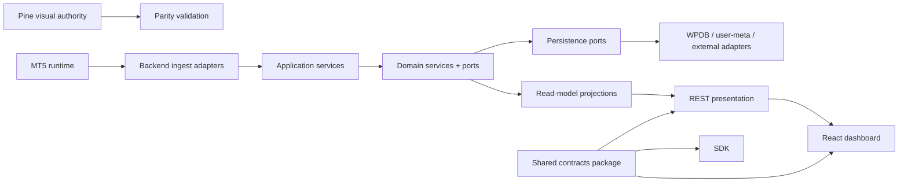

# SMC SuperFIB Architecture Review and Refactor Plan

Date: 2026-06-17

## 1. Executive Summary

This repository is not a single application. It is a trading platform workspace containing:

- a React dashboard (`src/`)
- a WordPress REST backend (`wordpress/smc-superfib-sniper/`)
- an MT5 EA plus market, fib, regime, signal, and execution engines (`mt5/`)
- an SDK intended to expose the same contracts externally (`sdk/`)
- operational automation, parity validators, migration governance, and reporting artifacts (`scripts/`, `.github/`, `reports/`)

The core architectural problem is not lack of functionality. The problem is that authoritative business rules are spread across multiple layers with inconsistent ownership:

- backend truth is mixed with transport and persistence logic
- MT5 logic mirrors backend logic instead of publishing narrow canonical facts
- frontend hooks contain application orchestration, authority handling, cache policy, and domain normalization
- SDK contracts and client normalization duplicate frontend contract logic
- repo governance artifacts assume strong authority boundaries, but the codebase only partially enforces them

The current system can be stabilized and refactored incrementally, but the backend must become the explicit authority host for every business truth before broader extraction continues.

## 2. Assessment Scope

Inspected surfaces:

- repo operating model and workflow guidance in `AGENTS.md`, `docs/agents/*`, `.github/AGENTS.md`, `CONTEXT.md`
- dashboard app in `src/`
- WordPress backend in `wordpress/smc-superfib-sniper/`
- MT5 engines in `mt5/`
- SDK sources in `sdk/src/`
- workflow scripts and parity tooling in `scripts/`
- prior reports, audits, and risk registers in `reports/` and `.github/migration/`

Material structural evidence:

- `wordpress/smc-superfib-sniper/smc-superfib-sniper.php` is roughly 9.4k lines and owns route wiring, schema setup, auth, settings, market ingestion, engine orchestration, signal board persistence, trade plans, telemetry, soak reporting, execution, approvals, and license handling.
- `mt5/MarketDataEngine.mqh` is roughly 1k lines and orchestrates tick processing, candle building, fib dispatch, regime dispatch, signal candidate dispatch, heartbeat, license-check, account-sync, and symbol-sync.
- `src/routes/admin.tsx` is a large multi-responsibility admin workspace mixing access control, data loading, state machines, soak authoring, export, print, and presentation.
- `src/hooks/useSniperData.ts` acts as the frontend application service layer, cache policy layer, watchlist authority layer, and mutation coordination layer simultaneously.
- `sdk/src/client/SniperClient.ts` duplicates significant normalization and contract logic already present in `src/lib/api/sniperClient.ts`.

## 3. Current Architecture Assessment

### 3.1 Effective architecture today

The system behaves like a distributed layered-monolith:

- MT5 computes and pushes market, fib, regime, and signal candidate data.
- WordPress ingests, persists, recomputes, arbitrates, and exposes REST responses.
- React polls backend endpoints and adds local cache, watchlist, and presentation coordination.
- SDK re-exposes a second client contract layer for outside consumers.

This is workable for a single owner, but it is fragile for multi-developer ownership because the actual boundaries are implicit and frequently crossed.

### 3.2 What is already working architecturally

- There is strong operational awareness in the repo: reports, phase gates, parity scripts, and risk registers are unusually mature.
- Backend authority discipline is repeatedly documented and partially enforced.
- Some extraction has already started in the backend:
  - `class-route-registrar.php`
  - `class-settings-service.php`
  - `class-watchlist-service.php`
  - `class-signal-aggregator.php`
- MT5 engines are separated by technical concern better than the backend monolith:
  - `FibEngine`
  - `RegimeEngine`
  - `SignalEngine`
  - `FreshnessEngine`
  - `ExecutionEngine`
- The frontend uses typed models and query keys consistently enough to support staged application-layer extraction.

### 3.3 Where the architecture is failing

#### A. Authority boundaries are documented but not encoded

The repo says backend truth must dominate dashboard truth and Pine remains visual authority during migration. In code, the truth boundaries are inferred from conventions, comments, and regression tests rather than explicit ports and domain services.

#### B. The WordPress backend is a god object

The main backend class owns:

- schema migration
- route contracts
- auth
- CORS
- settings and risk mutation logic
- watchlist normalization and invalidation
- MT5 ingest validation
- market quote and candle fetching
- fib math
- regime computation and storage
- signal candidate ingestion
- display signal board arbitration
- trade plan construction
- telemetry and progress
- soak workflows
- execution queue and approval queue
- license resolution

That concentration prevents safe ownership splitting, makes dependency direction opaque, and raises regression risk for every change.

#### C. Domain duplication exists across backend, MT5, frontend, and SDK

Examples:

- watchlist normalization and symbol alias handling exist in multiple places
- freshness and authority semantics exist in backend, frontend, and MT5
- plan completeness and executable-lot rules exist in backend and frontend
- contract normalization exists in frontend `sniperClient` and SDK `SniperClient`
- type models diverge between `src/types/sniper.ts` and `sdk/src/types/index.ts`

#### D. Presentation layers contain application and domain concerns

Examples:

- `src/hooks/useSniperData.ts` decides canonical watchlist behavior, mutation ordering, cache invalidation policy, and authority rules
- `src/routes/-plan.page.tsx` mixes board ranking, fallback policy, freshness interpretation, and UI composition
- `src/components/PlanCard.tsx` mixes rendering with execution gating policy and plan-lot warning rules
- `src/routes/admin.tsx` implements a full admin workflow state machine inline

#### E. Persistence model and business model are coupled

WordPress table schema, user meta snapshot cache, display board persistence, and route response shaping are tightly intertwined. That makes it hard to reason about whether the canonical state is:

- database rows
- computed engine snapshot
- display_signals table
- trade_plans table
- current REST payload

## 4. Technical Debt Inventory

### Critical

1. Backend monolith concentration

- Risk: very high regression blast radius
- Evidence: `wordpress/smc-superfib-sniper/smc-superfib-sniper.php`
- Impact: safe modular ownership is nearly impossible

2. Hidden multi-source truth for trading state

- Risk: backend, MT5, Pine reference, dashboard cache, and persisted display rows can disagree
- Impact: operator confidence and parity governance degrade

3. Contract duplication between frontend and SDK

- Risk: response normalization and type evolution drift
- Evidence: `src/lib/api/sniperClient.ts` and `sdk/src/client/SniperClient.ts`

4. Incomplete domain extraction

- Risk: helper classes exist, but business orchestration still depends on monolith internals
- Impact: superficial modularity without real decoupling

### High

1. Frontend application layer embedded inside hooks and route files

- Evidence: `src/hooks/useSniperData.ts`, `src/routes/-plan.page.tsx`, `src/routes/admin.tsx`
- Impact: testing and reuse costs are high

2. MT5 and backend both own overlapping behavioral logic

- Evidence: fib, regime, and signal candidate computation paths
- Impact: parity work requires comparing two implementations instead of validating one canonical model plus one publisher

3. User-meta engine snapshot cache is implicit infrastructure with domain significance

- Evidence: `smc_sf_engine_snapshot`
- Impact: caching bugs become business-truth bugs

4. Display signal board persistence is a separate truth layer

- Evidence: `smc_sf_display_signals`
- Impact: lifecycle and promotion rules can diverge from raw engine outputs

### Medium

1. Admin workflow is effectively a mini-product embedded in one route file

- Impact: hard to extend or test safely

2. Scripts and reports encode architectural knowledge outside code

- Impact: critical invariants live in docs rather than enforceable modules

3. SDK lags domain richness in some areas

- Example: frontend `FreshnessState` includes `closed_session`, SDK does not
- Impact: external consumers can receive an incomplete contract model

4. Test concentration does not match runtime concentration

- Example: one backend contract test file is ~2.8k lines
- Impact: verification exists, but maintainability is degrading

## 5. Divergence Map: Where Truth Can Split

The highest-value refactor outcome is not prettier folders. It is explicit authoritative sources for each truth domain.

### 5.1 Signal truth

Current divergence points:

- Pine visual authority vs MT5 candidate generation
- MT5 `SignalEngine` candidate output vs WordPress `post_ea_signal_candidates()` persistence
- raw MT5 signal candidates table vs backend `build_symbol_state()` computed signal
- backend engine snapshot `signals` vs `display_signals` durable board
- backend board response vs frontend global fallback response shaping
- backend-confirmed signal vs frontend-rendered unconfirmed signal card

Authoritative source recommended:

- During migration:
  - Pine remains validation authority for parity
  - WordPress backend becomes operational signal authority for dashboard and execution
- MT5 should publish candidate facts, not final dashboard truth

Required architectural change:

- create `SignalArbiter` domain service in backend application/domain layer
- make `display_signals` a projection owned by the arbiter, not an alternate logic source
- expose raw candidates, arbitration result, and board projection as separate concepts

### 5.2 Plan truth

Current divergence points:

- backend `build_trade_plan()` vs frontend `isTradePlanComplete()`
- backend minimum executable lot logic vs frontend `getMinExecutableStageLot()`
- backend execution eligibility vs frontend button gating in `PlanCard.tsx`
- persisted `trade_plans` rows vs plan payload returned from current snapshot/board flow

Authoritative source recommended:

- WordPress backend owns all plan construction, completeness, executable-lot, and execution-eligibility rules

Required architectural change:

- create `TradePlanService` domain/application boundary
- return explicit plan status fields from backend instead of recomputing plan policy in React
- keep frontend warnings as pure rendering of backend-declared states

### 5.3 Regime truth

Current divergence points:

- Pine regime reference vs MT5 `RegimeEngine`
- MT5 regime snapshot vs backend regime snapshot persistence
- backend `build_symbol_state()` regime interpretation vs frontend badge display assumptions
- possible contract drift between frontend and SDK regime types

Authoritative source recommended:

- Pine remains parity reference
- backend owns operational regime truth served to UI and downstream execution decisions
- MT5 publishes regime snapshots as inputs, not final user-facing truth

Required architectural change:

- create `RegimeService` plus `RegimeSnapshotRepository`
- separate raw MT5 regime payloads from backend normalized regime state

### 5.4 License truth

Current divergence points:

- EA `SendLicenseCheck()` startup gate
- backend `get_ea_license_check()`
- backend `/user/license`
- admin license tier mutation path
- any future frontend feature gating based on user license

Authoritative source recommended:

- backend license policy service and license store only
- EA consumes a signed/explicit policy response; it must not infer license state from partial fields

Required architectural change:

- extract `LicensePolicyService`
- separate:
  - license assignment persistence
  - entitlement evaluation
  - EA bridge response shaping
  - UI read-model shaping

### 5.5 Dashboard truth

Current divergence points:

- React Query cache vs live REST payload
- `user-settings` cache as watchlist authority vs mutation response authority
- `localStorage` schema invalidation vs server freshness
- route-level derived fallback behavior
- frontend stale/pending interpretation of backend states

Authoritative source recommended:

- backend owns dashboard data truth
- frontend owns view-state only:
  - loading
  - optimistic mutation state
  - local animation state

Required architectural change:

- move frontend orchestration into explicit application services/adapters
- keep route files and components passive
- treat React Query cache as transport cache, not domain state

## 6. Hidden Dependencies and Coupling

### Backend

- many route handlers depend on `get_settings()`, `ensure_engine_snapshot()`, and shared table helpers
- cache invalidation and watchlist behavior are coupled through user meta side effects
- execution, signal board, and telemetry paths all transit shared helper functions inside the monolith

### MT5

- `MarketDataEngine` is the transport orchestrator and also the cross-domain coordinator
- heartbeat, account-sync, symbol-sync, regime dispatch, fib dispatch, and signal dispatch all depend on shared initialization and cached broker offset behavior

### Frontend

- many screens depend on `useSniperData.ts` as a hidden service container
- `PlanCard` depends on route utilities for plan rules
- routing, API normalization, authority behavior, and UI fallback logic are interleaved

### SDK

- SDK duplicates types and normalization that are not generated from a single contract source
- frontend and SDK can drift independently while both appear correct locally

## 7. Duplication Hotspots

1. API normalization logic

1. `src/lib/api/sniperClient.ts`
2. `sdk/src/client/SniperClient.ts`

1. Type definitions

1. `src/types/sniper.ts`
2. `sdk/src/types/index.ts`

1. Watchlist normalization / symbol canonicalization

1. frontend hook utilities
2. backend watchlist service
3. MT5 symbol normalizer

1. Freshness and state vocabulary

1. MT5 freshness engine
2. backend health/snapshot interpretation
3. frontend badge and rendering behavior
4. SDK type surface

1. Plan executability rules

1. backend lot sizing and plan state
2. frontend `-plan.utils.ts`
3. `PlanCard.tsx`

## 8. Scalability Risks

### Team scalability

- code ownership boundaries are unclear
- one developer changing a route may accidentally alter persistence semantics or authority behavior

### Change scalability

- any backend feature touching signals, plans, or telemetry likely touches the same monolith
- major test files are growing with the monolith rather than testing extracted services

### Runtime scalability

- user-meta engine snapshot cache is not an explicit cache abstraction
- projection recomputation and persistence strategy are embedded in request handlers
- high-frequency ingest and large operational workflows coexist in one plugin class

## 9. Proposed Target Architecture

Use a pragmatic hexagonal architecture with explicit bounded contexts, not a blanket folder shuffle.

### 9.1 Architectural principles

- domain rules must not depend on WordPress, React, or MT5 transport details
- application services orchestrate use cases
- infrastructure adapters handle REST, WPDB, user meta, MT5 web requests, and React Query
- presentation layers render read models only
- every truth domain has one authoritative service

### 9.2 Proposed bounded contexts

- `market-data`
- `fib-parity`
- `regime`
- `signal-board`
- `trade-planning`
- `execution`
- `telemetry-progress`
- `settings-watchlist`
- `license-entitlement`
- `soak-operations`

## 10. Proposed Folder Structure

### Backend

```text
wordpress/smc-superfib-sniper/
  app/
    bootstrap/
      plugin-bootstrap.php
      route-bootstrap.php
    application/
      market-data/
      regime/
      signals/
      plans/
      execution/
      telemetry/
      settings/
      license/
      soak/
    domain/
      market-data/
        entities/
        value-objects/
        services/
        ports/
      regime/
      signals/
      plans/
      execution/
      telemetry/
      settings/
      license/
      soak/
    infrastructure/
      wordpress/
        rest/
        auth/
        hooks/
      persistence/
        wpdb/
        user-meta/
      external/
        twelve-data/
      projections/
        display-signals/
        trade-plans/
    presentation/
      rest/
        controllers/
        request-mappers/
        response-mappers/
  tests/
    unit/
    integration/
    contract/
```

### Frontend

```text
src/
  app/
    providers/
    router/
    query/
  domains/
    market-data/
      model/
      queries/
      mappers/
      view-models/
    regime/
    signals/
    plans/
    telemetry/
    settings/
    license/
    soak/
  application/
    services/
    policies/
  infrastructure/
    api/
    auth/
    storage/
    query/
  presentation/
    routes/
    components/
    ui/
  shared/
    types/
    formatting/
    utils/
```

### MT5

```text
mt5/
  app/
    orchestrators/
      MarketDataRuntime.mqh
  domain/
    market-data/
    fib/
    regime/
    signals/
    execution/
    symbols/
  infrastructure/
    http/
    serialization/
    time/
    terminal/
```

### Shared contracts

```text
packages/
  contracts/
    src/
      signal-board.ts
      plans.ts
      regime.ts
      telemetry.ts
      settings.ts
      license.ts
```

The SDK and frontend should consume generated/shared contracts from this package rather than maintaining parallel copies.

## 11. Dependency Flow



Required direction:

- presentation depends on application
- application depends on domain
- infrastructure depends on domain/application ports
- domain depends on nothing framework-specific

## 12. Phased Migration Plan

The refactor must be incremental and behavior-preserving.

### Phase 0. Baseline and safety net

- freeze current behavior with architecture characterization docs and contract tests
- add inventories for:
  - routes
  - tables
  - snapshot caches
  - projection tables
  - authority-producing functions
- create source-of-truth matrix and route-to-use-case matrix

### Phase 1. Contract consolidation

- establish shared contract package from current `src/types/sniper.ts`
- make SDK and frontend consume the same generated/shared contract source
- do not change payload shape

### Phase 2. Backend extraction by bounded context

Extract in this order:

1. `settings-watchlist`
2. `license-entitlement`
3. `telemetry-progress`
4. `soak-operations`
5. `signal-board`
6. `trade-planning`
7. `market-data` and `regime`

Rationale:

- start with lower-risk contexts that already have helper extractions
- defer signal/plan/market domains until extraction patterns are proven

### Phase 3. Backend projection isolation

- isolate:
  - engine snapshot cache
  - display signal board projection
  - trade plan projection
- expose projection repositories behind ports
- make caches explicitly infrastructural

### Phase 4. Frontend application-layer extraction

- replace `useSniperData.ts` god-hook with domain query modules and application services
- move policy helpers out of route files
- make components render backend-declared state only

### Phase 5. MT5 transport/domain split

- keep current engine behavior
- extract HTTP dispatch, payload serialization, and domain calculations into separate modules
- make MT5 publish narrower facts and less orchestration detail

### Phase 6. Monolith shrink pass

- leave a thin plugin bootstrap and REST facade
- retain compatibility function signatures where needed
- remove only dead compatibility glue after parity and regression evidence

## 13. Concrete Refactor Examples

### Example A. Plan authority

Current:

- backend computes plan
- frontend recomputes completeness and minimum-lot warnings

Refactor:

- backend returns:
  - `planStatus`
  - `executionEligibility`
  - `lotWarnings`
  - `minExecutableLot`
- frontend renders those fields directly

Why:

- removes policy duplication
- keeps plan truth in one place

### Example B. Signal board

Current:

- raw candidates, engine snapshot signals, and display board rows interact inside one class

Refactor:

- create:
  - `SignalCandidateRepository`
  - `DisplaySignalProjectionRepository`
  - `SignalArbiter`
  - `SignalBoardQueryService`

Why:

- makes raw candidate ingestion distinct from board projection
- clarifies which layer owns lifecycle promotion and invalidation

### Example C. Frontend data access

Current:

- `useSniperData.ts` owns query enablement, polling, watchlist state, mutation invalidation, and local normalization

Refactor:

- split into:
  - `domains/settings/queries/useUserSettingsQuery.ts`
  - `domains/watchlist/application/useCanonicalWatchlist.ts`
  - `domains/market-data/queries/useSnapshotQuery.ts`
  - `application/services/watchlistMutationCoordinator.ts`

Why:

- keeps React Query concerns separate from watchlist business policy

## 14. Testing Strategy

### Preserve current behavior through characterization

Add and reorganize tests around contracts rather than file boundaries.

### Backend

- unit tests for extracted domain services
- integration tests for repositories and user-meta cache behavior
- REST contract tests for payload shape and status codes
- projection tests for `display_signals` and `trade_plans`

### Frontend

- query/mapping tests for each domain adapter
- route integration tests for view models
- component tests only for rendering and interaction states

### MT5

- keep existing engine tests
- add serialization contract tests for each outbound payload family
- add parity replay suites that compare MT5 published facts against backend expectations

### Cross-layer

- contract snapshot tests for:
  - `/snapshot/unified`
  - `/live-signals`
  - `/ladders`
  - `/health`
  - `/user/license`
- parity suites for:
  - fib
  - regime
  - signal candidates
  - display signal lifecycle

### Highest-priority missing governance test

- one source-of-truth regression suite per truth domain:
  - signal
  - plan
  - regime
  - license
  - dashboard read-model

## 15. Governance Risks

1. Folder-first refactor without authority-first extraction

- likely outcome: prettier layout, same hidden truth drift

1. Contract cleanup before characterization tests

- likely outcome: accidental API or UI behavior changes

1. Frontend cleanup before backend authority extraction

- likely outcome: more client-side policy and more truth drift

1. MT5/backend parity work continuing with duplicated business logic

- likely outcome: each parity fix becomes a two-implementation patch

1. SDK continuing as a parallel contract owner

- likely outcome: external and internal clients slowly diverge

## 16. Recommended Immediate Actions

1. Treat the backend as the first refactor target, not the frontend.
2. Establish a written source-of-truth matrix and route-to-use-case map as living repo artifacts.
3. Extract shared contracts before broader presentation refactors.
4. Create explicit backend services for:
   - `SignalArbiter`
   - `TradePlanService`
   - `RegimeService`
   - `LicensePolicyService`
   - `DashboardSnapshotService`
5. Convert engine snapshot and display signal board into named infrastructure/projection concepts.
6. Break `useSniperData.ts` only after backend authorities and shared contracts are stable.

## 17. Final Recommendation

The correct migration path is not a large rewrite. It is a staged authority-consolidation refactor:

- first define authoritative truths
- then extract backend domain/application seams
- then consolidate contracts
- then simplify frontend orchestration
- then reduce MT5/backend duplication

If this sequence is followed, the platform can move toward Clean Architecture / Hexagonal Architecture with low operational risk and without changing business behavior, API contracts, signal logic, or licensing logic.
